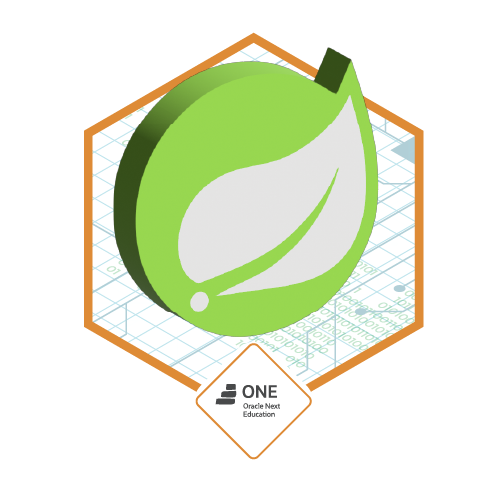

# Desafio Fórum Hub - API REST com Java e Spring Boot

<div align="center">

[](https://opensource.org/licenses/MIT)  
[](https://www.java.com/)  
  


</div><br>

## Badge de Conquista

Este projeto foi desenvolvido como parte do programa ONE - "Oracle Next Education", uma parceria entre a Alura e a Oracle. Como reconhecimento, foi concedido o seguinte badge:

<div align="center">



</div>

## Sobre o Desafio

O desafio Fórum Hub propõe a criação de uma API REST utilizando Java e Spring Boot. O objetivo é proporcionar uma experiência prática no papel de desenvolvedor back-end, aplicando conceitos avançados como criação de endpoints e implementação de segurança. Este projeto é uma etapa essencial do programa ONE, consolidando os conhecimentos adquiridos.

## Estrutura do Projeto

O projeto segue as melhores práticas de desenvolvimento com Spring Boot, utilizando a arquitetura MVC (Model-View-Controller). A organização dos diretórios é a seguinte:

```bash
forum-hub/
├── src/
│   ├── main/
│   │   ├── java/
│   │   │   └── com/
│   │   │       └── forumhub/
│   │   │           ├── controller/
│   │   │           ├── model/
│   │   │           ├── repository/
│   │   │           ├── service/
│   │   │           └── ForumHubApplication.java
│   │   └── resources/
│   │       ├── application.properties
│   └── test/
│       └── java/
│           └── com/
│               └── forumhub/
├── .gitignore
├── README.md
└── pom.xml
```

## Funcionalidades da API

A API REST do Fórum Hub oferece as seguintes funcionalidades:

- **Gerenciamento de Usuários:**
  - Cadastro de novos usuários.
  - Login e autenticação.
  - Consulta de informações de perfil.

- **Gerenciamento de Tópicos:**
  - Criação de tópicos.
  - Listagem de tópicos existentes.
  - Atualização e exclusão de tópicos.

- **Gerenciamento de Respostas:**
  - Adição de respostas a tópicos.
  - Listagem de respostas em um tópico específico.

- **Segurança:**
  - Autenticação baseada em JWT para proteger os endpoints.
  - Configuração de níveis de acesso.

## Tecnologias Utilizadas

- **Java 17:** Linguagem principal para o desenvolvimento.
- **Spring Boot:** Framework para construção da aplicação.
- **Spring Security:** Para implementação de segurança.
- **JWT (JSON Web Token):** Para autenticação de usuários.
- **H2 Database:** Banco de dados em memória para testes.
- **Maven:** Gerenciador de dependências e build.

## Configuração do Ambiente

Siga os passos abaixo para configurar o ambiente de desenvolvimento:

1. **Clone o repositório:**
   ```bash
   git clone https://github.com/seu-usuario/forum-hub.git
   cd forum-hub
   ```

2. **Instale as dependências com Maven:**
   ```bash
   mvn install
   ```

3. **Inicie a aplicação:**
   ```bash
   mvn spring-boot:run
   ```
   A aplicação estará disponível em `http://localhost:8080`.

## Testes

Os testes unitários e de integração estão localizados no diretório `src/test/java/com/forumhub`. Para executá-los, utilize o comando:

```bash
mvn test
```

## Como Contribuir

Contribuições são bem-vindas! Você pode enviar sugestões, correções de bugs ou melhorias por meio de issues ou pull requests.

## Licença

Este projeto está licenciado sob a Licença MIT.
